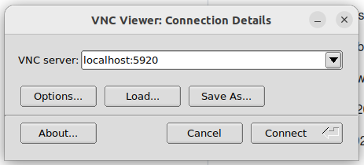
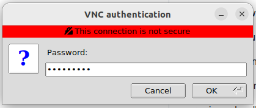
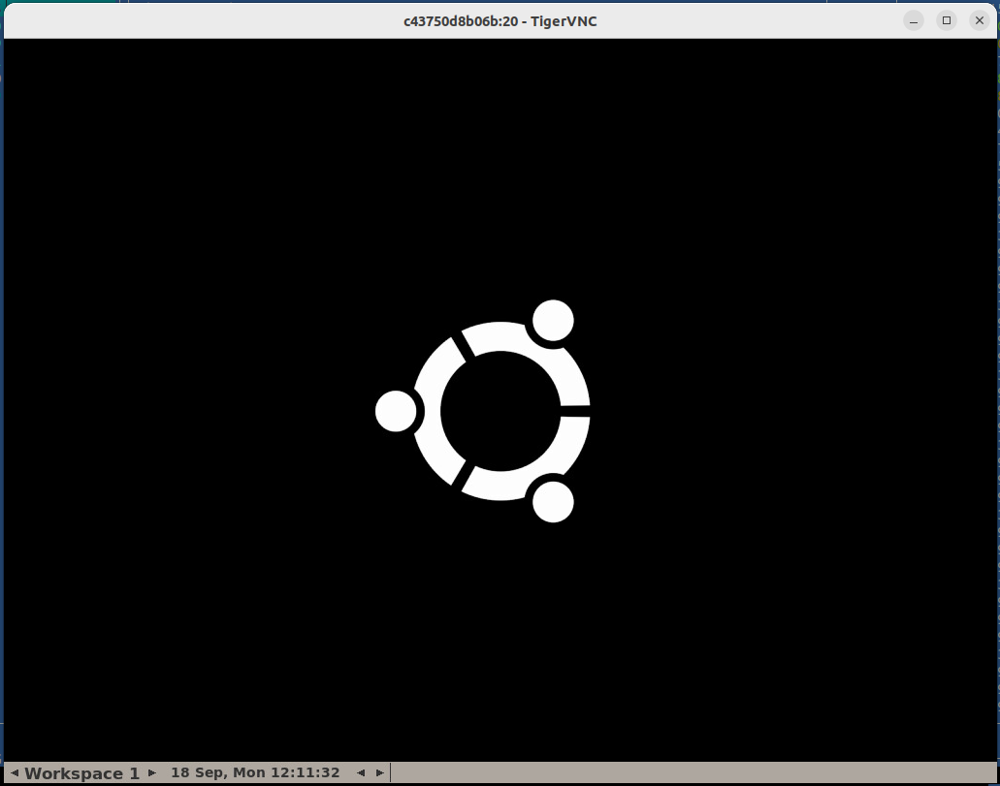
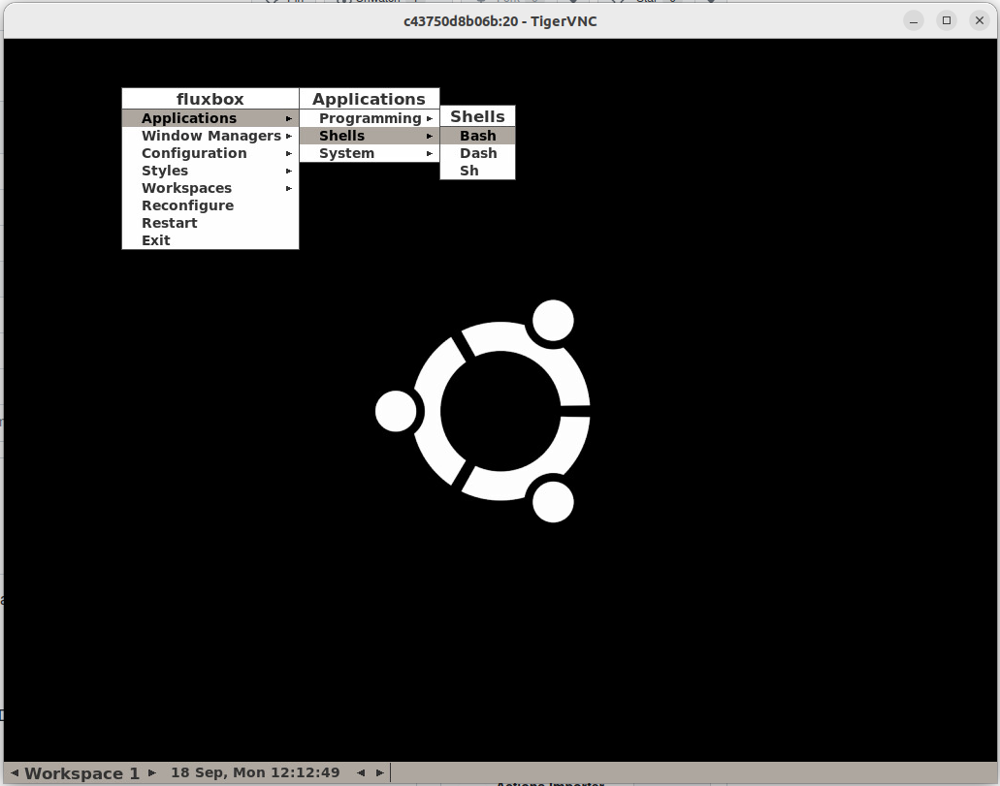
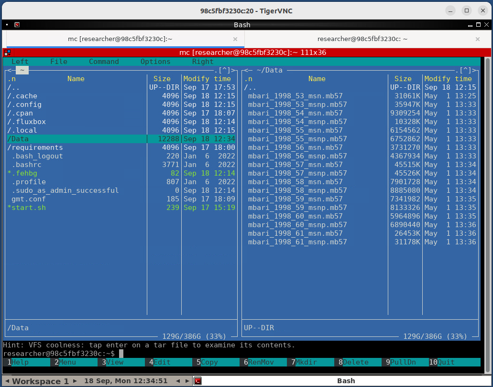
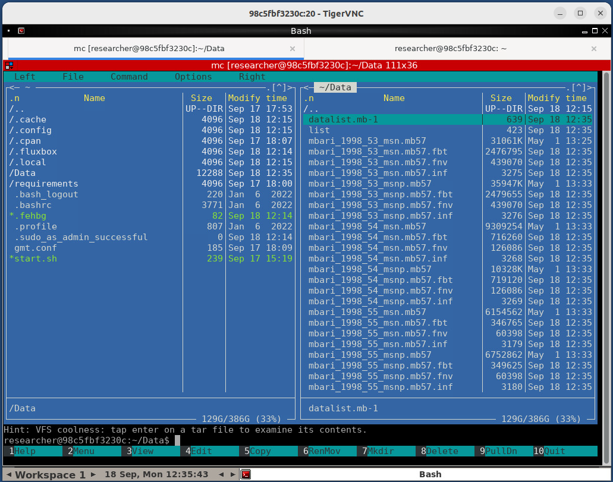
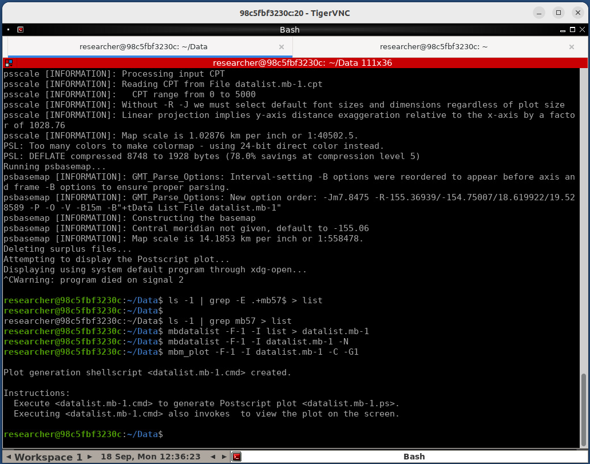
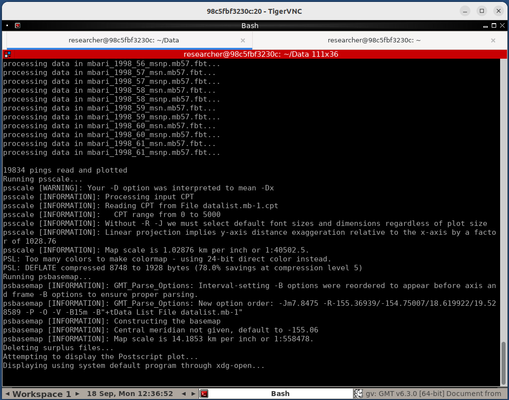
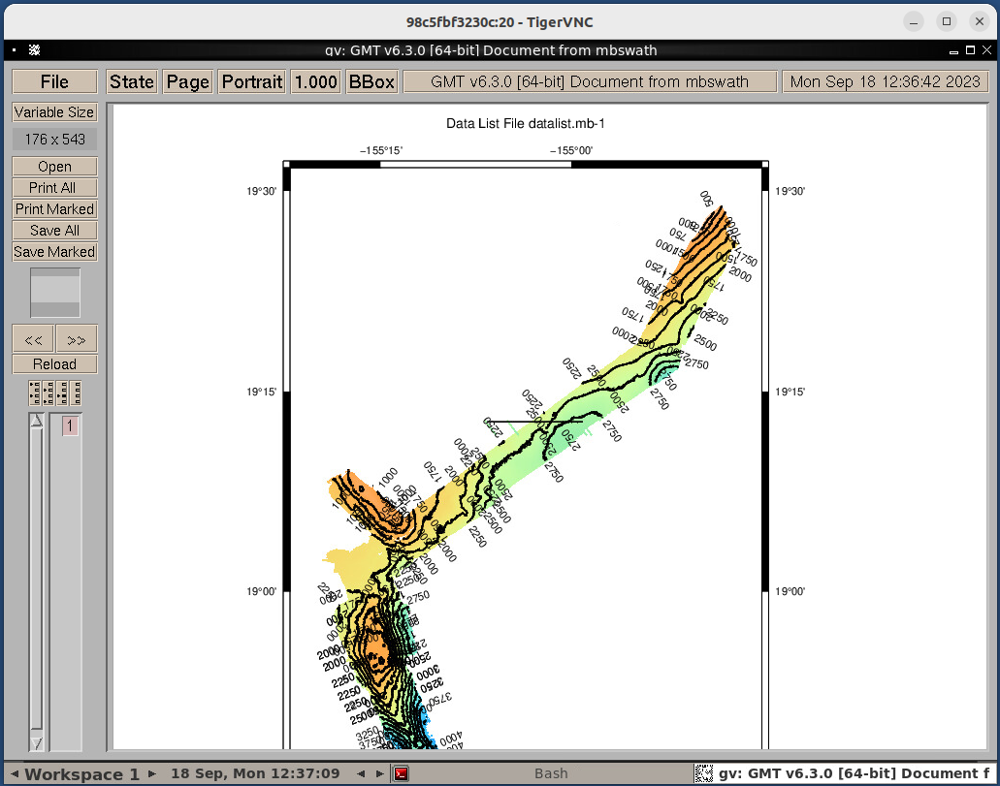

# mb-system-docker-vnc
Remote work with mb-system inside a Docker, run GUI applications

docker compose build
docker compose up

Run docker container with shared Data dir

TigerVNC Viewer can be used to connect to the container with params:
localhost:5920, passwd: SecretKey

  
  

Desktop resolution and password can be changed in the start.sh file

  
  

Some data to check the operation of the system can be downloaded from the resource
https://www.ngdc.noaa.gov/ships/ocean_alert/Loihi_mb.html

  

ls -1 | grep mb57 > list
mbdatalist -F-1 -I list > datalist.mb-1
mbm_plot -F-1 -I datalist.mb-1 -C -G1

  
  

./datalist.mb-1.cmd

  
  

Versions:
ENV MB_SYSTEM_V 5.7.9
ENV GMT_V 6.3.0
ENV GSHHG_V 2.3.7
ENV DCW_V 2.1.2
